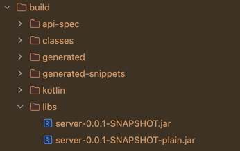
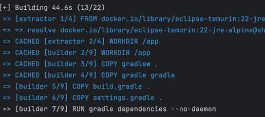
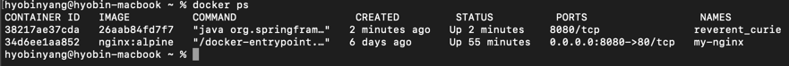

## GOAL: 도커 파일 효율성 높이기(장원님 강의 참고)

### 1. 프로젝트 빌드
- 스프링 프로젝트를 빌드해서 실행 가능한 .jar 파일 생성


### 2. bootJar가 레이어드 JAR를 만들도록 설정
- build.gradle 파일에 layered 설정 추가
```
tasks.named('bootJar') {
	layered {}
	dependsOn tasks.named('copyOasToSwagger')
}
```

### 3. Dockerfile 작성
- layer 활용하지 않았던 이전 도커 파일
```
FROM gradle:jdk22 AS builder
WORKDIR /app

COPY gradlew .
COPY gradle gradle
COPY build.gradle .
COPY settings.gradle .
RUN gradle dependencies --no-daemon

COPY src src
RUN gradle bootJar --no-daemon -x test

FROM eclipse-temurin:22-jre-alpine
WORKDIR /app

COPY --from=builder /app/build/libs/*.jar /app/app.jar
EXPOSE 8080
ENTRYPOINT ["java", "-jar", "/app/app.jar"]
```

- layer 활용한 도커 파일 
```
# 1. 빌드 스테이지 (Builder Stage)
# JDK 환경에서 프로젝트를 빌드하여 실행 가능한 JAR 파일을 생성

FROM gradle:jdk22 AS builder
WORKDIR /app

# Gradle 관련 파일만 먼저 복사 -> 의존성 레이어를 캐싱
COPY gradlew .
COPY gradle gradle
COPY build.gradle .
COPY settings.gradle .
# 의존성 먼저 다운로드 - build.gradle이 바뀌지 않으면 캐시 사용하도록
RUN gradle dependencies --no-daemon

# 소스 코드를 복사하고 애플리케이션을 빌드
COPY src src
RUN gradle bootJar --no-daemon -x test


# 2. JAR 분해 스테이지 (Extractor Stage)
# 빌드된 JAR 파일을 layertools를 이용해 여러 레이어로 분해
FROM eclipse-temurin:22-jre-alpine AS extractor
WORKDIR /app

# 빌더 스테이지에서 생성된 JAR 파일을 복사
COPY --from=builder /app/build/libs/*.jar /app/app.jar
# layertools를 사용해 JAR 파일의 압축을 풀어 레이어별로 디렉토리를 생성
RUN java -Djarmode=layertools -jar app.jar extract


# 3. 최종 실행 스테이지 (Final Runner Stage)
# 분해된 레이어들을 JRE만 있는 가벼운 이미지에 복사하여 최종 이미지 생성
FROM eclipse-temurin:22-jre-alpine AS runner
WORKDIR /app

EXPOSE 8080

# Extractor 스테이지에서 분해된 레이어들을 순서대로 복사
# 의존성 -> 스프링 부트 로더 -> 애플리케이션 순으로 복사하여 캐시 효율 높이기
COPY --from=extractor /app/dependencies/ ./
COPY --from=extractor /app/spring-boot-loader/ ./
COPY --from=extractor /app/snapshot-dependencies/ ./
COPY --from=extractor /app/application/ ./

# Spring Boot Loader를 통해 애플리케이션을 실행
ENTRYPOINT ["java", "org.springframework.boot.loader.launch.JarLauncher"]
```

- 핵심 변경 지점
  - 멀티 스테이지 & 레이어드 JAR 빌드 JAR를 의존성/애플리케이션 등 여러 조각으로 분해하여 각각 복사
  - 캐시 효율 높아짐: 소스 코드만 변경 시, 아주 작은 애플리케이션 레이어만 새로 빌드
  - 빌드 속도 향상: 두 번째 빌드부터는 캐시 덕분에 속도가 빨라짐
  - 가벼운 이미지 전송: 변경된 작은 레이어만 Docker Hub 등에 전송(push)하면 되므로 네트워크 사용량이 적다고 함
  - 작은 최종 이미지: 최종적으로 JRE(실행 환경)만 있는 가벼운 alpine 이미지를 사용해 용량이 작다고 함

  - 이렇게 두 번 이상 실행시키면 CACHED된 파일들이 생김
  - 처음 빌드 시 


### 4. Dockerfile 실행
