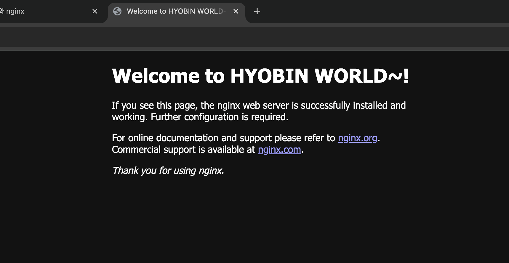
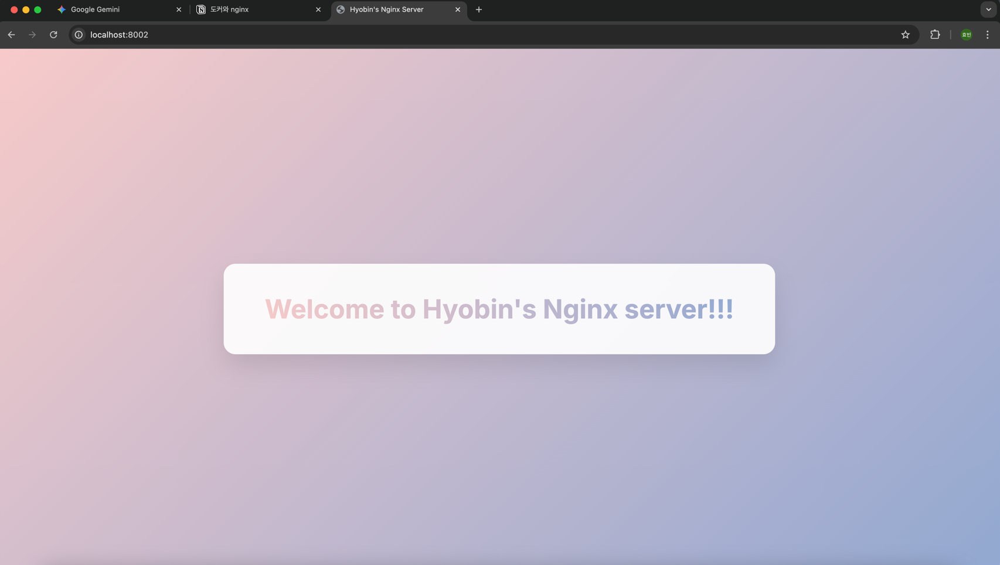

# 과제 1

## DIY 1: 로컬 nginx 이미지 8000 포트로 컨테이너 실행



## DIY 2: 새로운 이미지 빌드 및 8002 포트로 컨테이너 실행


- 제미나이와 협업한 예쁜 html 파일^^
```
<!DOCTYPE html>
<html lang="ko">
<head>
    <meta charset="UTF-8">
    <meta name="viewport" content="width=device-width, initial-scale=1.0">
    <title>Hyobin's Nginx Server</title>
    <style>
        /* Google Fonts에서 'Inter' 폰트를 가져옵니다 */
        @import url('https://fonts.googleapis.com/css2?family=Inter:wght@700&display=swap');

        /* 기본 스타일 초기화 */
        html, body {
            height: 100%;
            margin: 0;
            padding: 0;
            font-family: 'Inter', sans-serif; /* 기본 폰트 지정 */
            overflow: hidden; /* 스크롤바 제거 */
        }

        body {
            display: flex;
            justify-content: center;
            align-items: center;
            background: linear-gradient(135deg, #F7CAC9 0%, #92A8D1 100%);
        }


        .card {
            background-color: rgba(255, 255, 255, 0.9);
            padding: 50px 70px;
            border-radius: 20px;
            box-shadow: 0 20px 40px rgba(0, 0, 0, 0.1);
            text-align: center;
            animation: fadeIn 1.2s ease-in-out;
        }

        h1 {
            font-size: 2.8rem;
            margin: 0;
            background: linear-gradient(45deg, #F7CAC9, #92A8D1);
            -webkit-background-clip: text;
            -webkit-text-fill-color: transparent;
        }

        @keyframes fadeIn {
            from {
                opacity: 0;
                transform: translateY(30px);
            }
            to {
                opacity: 1;
                transform: translateY(0);
            }
        }
    </style>
</head>
<body>
    <div class="card">
        <h1>Welcome to Hyobin's Nginx server!!!</h1>
    </div>
</body>
</html>
```

