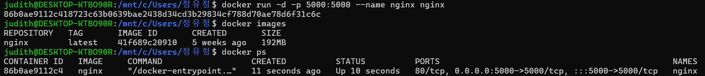

## Week1 과제

### 내용
- Docker 엔진을 이용해 nginx 이미지를 Pull & Run하여 웹 서버 실행
- OS: Windows 11 + WSL2 (Ubuntu)

### 결과

## TIL
### 컨테이너
- 기존 가상머신(VM)의 무거움을 극복하기 위한 가볍고 빠른 가상화 기술
- Host OS의 커널을 공유하여 오버헤드가 적고 부팅이 빠름
- 리눅스의 Cgroups(Control Groups)와 Namespaces 기술을 통해 프로세스와 자원을 격리함
    - Cgroups는 특정 프로세스 그룹(ex. 컨테이너)이 사용할 수 있는 하드웨어 자원의 양을 제한하고 관리하는 리눅스 커널 기능
    - Namespaces는 하나의 시스템을 여러 개의 독립된 가상 공간으로 나누어, 각 공간에 있는 프로세스가 마치 자기 혼자만 시스템을 사용하는 것처럼 느끼게 만드는 기술

### 도커
- 컨테이너 기술을 누구나 쉽게 사용하도록 만든 오픈소스 플랫폼
- 컨테이너를 만들고, 배포하고, 실행하는 전반의 과정을 관리함
- 아키텍처:
    - Docker Client (CLI): 사용자가 docker run, docker build 같은 명령어를 입력하는 인터페이스
    - Docker Daemon (Server): 클라이언트로부터 API 요청을 받아 이미지, 컨테이너, 네트워크, 볼륨 등 도커 객체를 실질적으로 관리하는 백그라운드 프로세스
    - Registry: 도커 이미지를 저장하고 공유하는 원격 저장소 
- 내부 동작: 
    - 사용자가 CLI에 명령을 입력하면 API를 통해 Docker Daemon에 전달됨
    - 데몬은 다시 containerd 와 같은 저수준 런타임을 호출하여 실제 컨테이너를 생성하고 실행
    > Docker vs containerd: Docker는 이미지 빌드, 네트워킹, Docker Swarm 같은 기능을 포함한 통합 상위 플랫폼임. 반면 containerd는 컨테이너 실행, 이미지 관리 등 핵심 기능에만 집중하는 저수준 런타임으로, Docker나 쿠버네티스에 의해 호출되어 사용됨.

### 컨테이너 오케스트레이션 
- 여러 서버의 수많은 컨테이너를 자동으로 배포, 확장, 관리하는 시스템
- k8s가 대표적