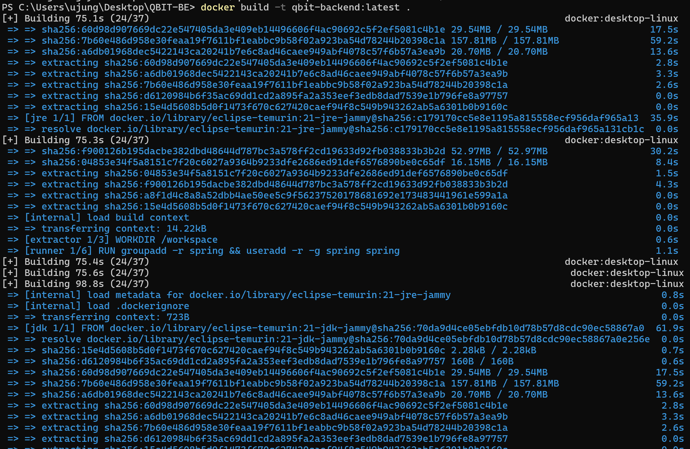
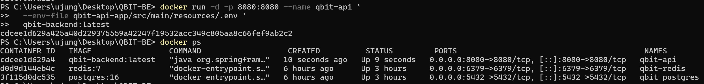

## Week2 과제

### 내용
- Dockerfile 사용하여 Spring Boot 백엔드 애플리케이션 컨테이너화 및 실행
- 햔제 개발 중인 프로젝트를 활용했습니다 

```dockerfile
# 빌드용 JDK 이미지
FROM eclipse-temurin:21-jdk-jammy AS jdk

# 실행용 JRE 이미지 (크기 최소화)
FROM eclipse-temurin:21-jre-jammy AS jre

# 애플리케이션 빌드
FROM jdk AS builder
WORKDIR /workspace

# Gradle Wrapper 복사 (캐시 활용)
COPY gradlew .
COPY gradle gradle/
COPY settings.gradle .
COPY gradle.properties .

# 모든 서브모듈 build.gradle 복사
COPY build.gradle .
COPY qbit-api-app/build.gradle qbit-api-app/
COPY qbit-websocket-app/build.gradle qbit-websocket-app/
COPY qbit-domain/build.gradle qbit-domain/
COPY qbit-common/build.gradle qbit-common/
COPY qbit-infra/build.gradle qbit-infra/
COPY qbit-client/qbit-stock-client/build.gradle qbit-client/qbit-stock-client/
COPY qbit-client/qbit-notification-client/build.gradle qbit-client/qbit-notification-client/

# 의존성 다운로드 (소스 변경 시에도 캐시 활용)
RUN chmod +x gradlew
RUN ./gradlew dependencies --no-daemon || true

# 소스 코드 복사 (자주 변경되므로 마지막에 배치)
COPY qbit-api-app/src qbit-api-app/src/
COPY qbit-websocket-app/src qbit-websocket-app/src/
COPY qbit-domain/src qbit-domain/src/
COPY qbit-common/src qbit-common/src/
COPY qbit-client/qbit-stock-client/src qbit-client/qbit-stock-client/src/

# 빌드
RUN ./gradlew :qbit-api-app:bootJar -x test --no-daemon

# Spring Boot 레이어 추출 
FROM jre AS extractor
WORKDIR /workspace

COPY --from=builder /workspace/qbit-api-app/build/libs/*.jar app.jar

# 레이어별로 추출
RUN java -Djarmode=layertools -jar app.jar extract --destination extracted

# 최종 실행 이미지
FROM jre AS runner

# 보안: non-root 사용자 생성
RUN groupadd -r spring && useradd -r -g spring spring

WORKDIR /workspace

COPY --from=extractor --chown=spring:spring /workspace/extracted/dependencies ./
COPY --from=extractor --chown=spring:spring /workspace/extracted/spring-boot-loader ./
COPY --from=extractor --chown=spring:spring /workspace/extracted/snapshot-dependencies ./
COPY --from=extractor --chown=spring:spring /workspace/extracted/application ./

USER spring:spring

ENTRYPOINT ["java", "org.springframework.boot.loader.launch.JarLauncher"]

EXPOSE 8080

```

### 결과
1. Docker 이미지 빌드 과정


2. Docker 컨테이너 실행 확인

qbit-api: 백엔드 애플리케이션 (포트 8080)
qbit-redis: Redis 캐시 서버 (포트 6379)
qbit-postgres: PostgreSQL 데이터베이스 (포트 5432)

3. Swagger UI 접속 성공

아직 화면이 없어서 스웨거 UI로 확인했습니다.