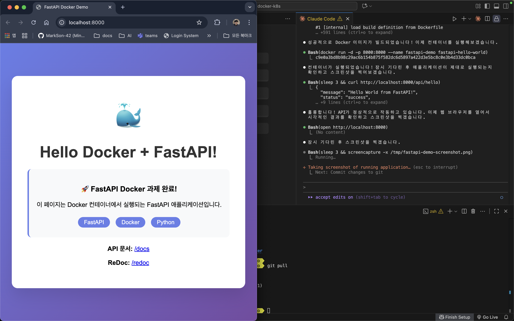

# FastAPI Docker Demo

Docker를 사용한 FastAPI Hello World 애플리케이션입니다.

## 프로젝트 구조
```
fastapi-docker/
├── Dockerfile              # Docker 이미지 빌드 설정
├── main.py                 # FastAPI 애플리케이션 코드
├── requirements.txt        # Python 의존성
├── README.md              # 프로젝트 설명
└── fastapi-demo-screenshot.png  # 실행 결과 스크린샷
```

## 기능
- **메인 페이지 (/)**: 시각적으로 아름다운 Hello World 페이지
- **API 엔드포인트 (/api/hello)**: JSON 응답 API
- **정보 엔드포인트 (/api/info)**: 애플리케이션 정보 API
- **API 문서 (/docs)**: FastAPI 자동 생성 문서
- **ReDoc (/redoc)**: 대안 API 문서

## Docker 실행 방법

### 1. Docker 이미지 빌드
```bash
docker build -t fastapi-hello-world .
```

### 2. 컨테이너 실행
```bash
docker run -d -p 8000:8000 --name fastapi-demo fastapi-hello-world
```

### 3. 애플리케이션 접속
- 메인 페이지: http://localhost:8000
- API 문서: http://localhost:8000/docs
- ReDoc: http://localhost:8000/redoc

### 4. 컨테이너 중지 및 제거
```bash
docker stop fastapi-demo
docker rm fastapi-demo
```

## 기술 스택
- **FastAPI**: 현대적이고 빠른 웹 API 프레임워크
- **Uvicorn**: ASGI 서버
- **Docker**: 컨테이너화
- **Python 3.11**: 기본 런타임

## API 테스트
```bash
# Hello API 테스트
curl http://localhost:8000/api/hello

# 정보 API 테스트
curl http://localhost:8000/api/info
```

## 실행 결과


애플리케이션이 성공적으로 Docker 컨테이너에서 실행되며, 아름다운 UI와 함께 완전한 API 기능을 제공합니다.