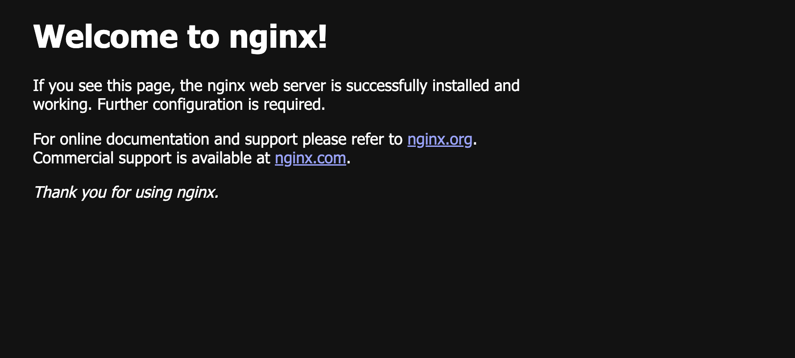

# Week 1: Docker 기초 - 환경 설정 및 nginx 실행

## 📋 과제 내용
- Docker Desktop 설치 (Mac 환경)
- nginx 이미지 pull 및 컨테이너 실행
- 실행 화면 스크린샷 캡처

## 🛠️ 실행 과정

### 1. Docker 설치 확인
```bash
docker --version
```

### 2. nginx 이미지 다운로드
```bash
docker pull nginx
```

### 3. nginx 컨테이너 실행
```bash
docker run -d -p 8080:80 --name minwoo-nginx nginx
```

### 4. 실행 중인 컨테이너 확인
```bash
docker ps
```

### 5. 웹 브라우저 접속 확인
- 브라우저에서 `http://localhost:8080` 접속
- nginx 기본 페이지 확인

## 📸 실행 결과



## 💡 학습 내용

### Docker 기본 명령어
- `docker pull`: 이미지 다운로드
- `docker run`: 컨테이너 실행
- `docker ps`: 실행 중인 컨테이너 조회
- `docker stop`: 컨테이너 중지

### 포트 매핑
- `-p 8080:80`: 호스트의 8080 포트를 컨테이너의 80 포트로 매핑
- 브라우저에서 localhost:8080으로 접속 가능

### 백그라운드 실행
- `-d` 옵션: 컨테이너를 백그라운드에서 실행 (detached mode)

## 🔧 환경 정보
- **OS**: macOS (Apple Silicon)
- **Docker Desktop**: v28.4.0
- **nginx**: latest (1.29.1)
- **실행 포트**: 8080

## 📝 추가 메모
- Docker Desktop 설치 후 애플리케이션 실행 필요
- 최초 실행 시 권한 승인 필요
- nginx 컨테이너는 정상적으로 실행되어 기본 페이지 확인 완료