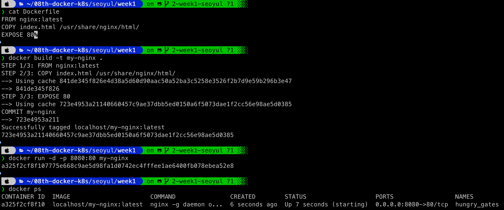
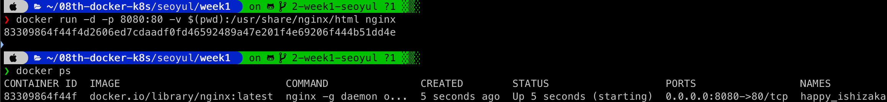

# Docker로 nginx 동작시키는 방법

Docker를 사용해서 nginx를 동작시키는 방법에는 크게 2가지가 있다.

## 1. Dockerfile을 만들어서 직접 배포하는 방법

### 장점

- 커스터마이징이 자유롭다
- 필요한 설정 파일들을 미리 포함시킬 수 있다
- 재사용 가능한 이미지를 만들 수 있다

### 방법

```dockerfile
# Dockerfile
FROM nginx:latest
COPY index.html /usr/share/nginx/html/
EXPOSE 80
```

```bash
# 이미지 빌드
docker build -t my-nginx .

# 컨테이너 실행
docker run -d -p 8080:80 my-nginx
```



## 2. docker run nginx 명령어로 직접 실행하는 방법

### 장점

- 빠르고 간단하다
- 테스트나 개발 환경에서 유용하다
- 별도의 Dockerfile 작성이 필요 없다

### 방법

```bash
# HTML 파일 마운트
docker run -d -p 8080:80 -v /path/to/html:/usr/share/nginx/html nginx
```



## 예제 파일들

### index.html

```html
<!DOCTYPE html>
<html lang="ko">
<head>
    <meta charset="UTF-8">
    <meta name="viewport" content="width=device-width, initial-scale=1.0">
    <title>클라우드 클럽</title>
    <style>
        body {
            font-family: Arial, sans-serif;
            text-align: center;
            margin-top: 100px;
            background-color: #f0f8ff;
        }
        h1 {
            color: #2c3e50;
            font-size: 2.5em;
        }
    </style>
</head>
<body>
    <h1>안녕하세요 클라우드 클럽 여러분</h1>
</body>
</html>
```


## 언제 어떤 방법을 사용할까?

- **Dockerfile 방법**: 프로덕션 환경, 복잡한 설정이 필요한 경우
- **docker run 방법**: 빠른 테스트, 간단한 개발 환경에서 사용
